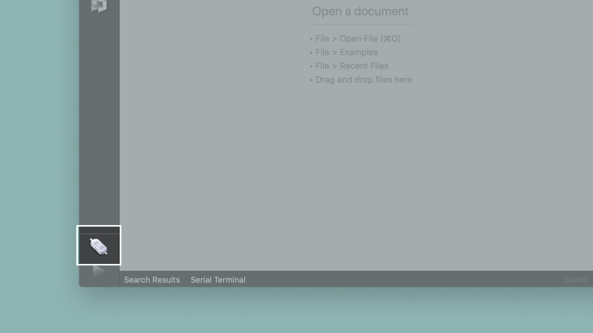

# The Things Conference Workshop
Think machine vision and machine learning is difficult to do on microcontrollers? Find out how to leverage cutting edge technology for developing LoRa powered solutions which run machine vision algorithms efficiently.
This repository hosts all the content and demo code to recreate the demos presented in Arduino's Things Conference Workshop hosted by Sebastian Romero ([@sebromero](https://github.com/sebromero)).

## What You Will Learn
- How to use the Arduino / OpenMV infrastructure to connect to a LoRa network
- How to do simple object detection using OpenMV
- How to run a custom machine learning model for machine vision applications

## Required Hardware and Software
To try out all the examples you need to have a [Portenta H7](https://store.arduino.cc/portenta-h7) development board and a Portenta Vision Shield. Also you need to download some additional software and register an account with The Things Network and Edge Impulse to follow all demos.

- The **Arduino IDE** can be downloaded from [this website](https://www.arduino.cc/en/software)
- The **OpenMV IDE** can be downloaded from [this website](https://openmv.io/pages/download)

- If you want to test the LoRa connectivity of the Portenta Vision Shield LoRa, you can register an account with **The Things Network** [here](https://account.thethingsnetwork.org/register).
- To create your own custom machine learning models as seen in the demos, you need to register an **Edge Impulse** account [here](https://studio.edgeimpulse.com/).

## Preparing the Arduino IDE for Portenta
Open the Arduino IDE and then open the board manager from the Tools menu. Search for "portenta". Find the Arduino mbed-enabled Boards library and click on "Install" to install the latest version of the mbed core (1.3.1 at the time of writing this guide). 

This is the software that allows you to access the Portenta's features. Choose the first one in the list, not the one which says "DEPRECATED". Once the installation completes, the Arduino IDE will be ready for your Portenta board.

More information on getting started with Portenta can be found [here](https://www.arduino.cc/pro/tutorials/portenta-h7/por-ard-gs).

## Preparing Portenta for OpenMV
Most of the demos from this workshop require the OpenMV firmware to be installed on Portenta. Therefore I suggest you pre-install this firmware. Keep in mind that every time you upload an Arduino sketch and switch back to the OpenMV IDE you will have to re-flash the OpenMV firmware.

Connect the Portenta to your computer via the USB-C cable if you haven't done so yet. Put the Portenta in bootloader mode by double pressing the reset button on the board. The built-in green LED will start fading in and out. Now open the OpenMV IDE. Click on the "connect" symbol at the bottom of the left toolbar. 

A pop-up will ask you how you would like to proceed "DFU bootloader(s) found. What would you like to do?". Select "Reset Firmware to Release Version". This will install the latest OpenMV firmware on the Portenta. 

Portenta's green LED will start flashing while the OpenMV firmware is being uploaded to the board. A terminal window will open which shows you the upload progress. Wait until the green LED stops flashing and fading. You will see a message saying "DFU firmware update complete!" when the process is done.

The Portenta will start flashing its blue LED when it's ready to be connected. After confirming the completion dialog the Portenta should already be connected to the OpenMV IDE, otherwise click the "connect" button once again.